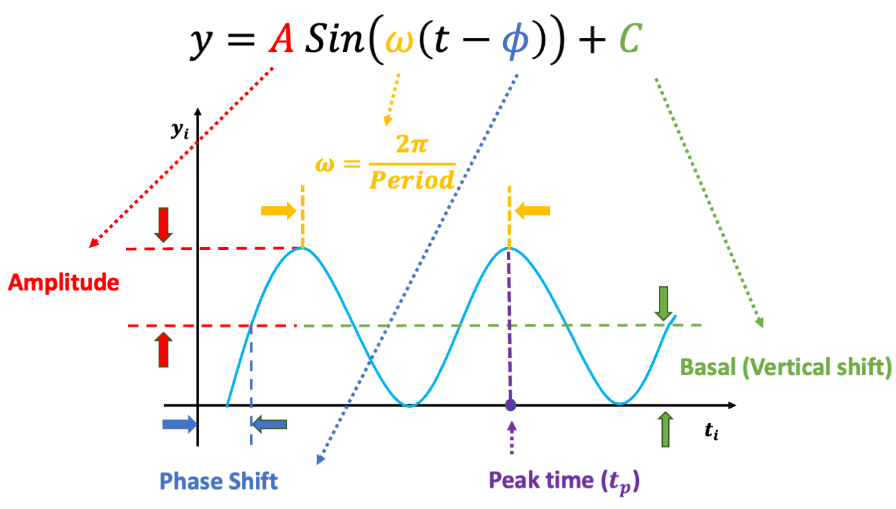

```{r, include = FALSE}
knitr::opts_chunk$set(
  collapse = TRUE,
  comment = "#>"
)

options(stringsAsFactors = FALSE)
```

# Introduction

## Background
Circadian rhythmicity in transcriptomic profiles has been implied in many physiological processes, and disruption of circadian patterns has been founded to associate with several diseases. Likelihood-based methods (diffCircadian) are powerful in detecting circadian rhythmicity within one experimental condition and differential circadian patterns comparing two experimental conditions. 





## Terminologies

Denote:

* $y$ as the expression value for a gene. 

* $t$ as the circadian time. 

* $C$ as the basal level (vertical shift of the sinusoidal wave baseline from 0). 

* $A$ as the amplitude. 

* $\omega$ is the frequency of the sinusoidal wave, where $\omega = \frac{2\pi}{Period}$. 


Without loss of generality, we set $period = 24$ hours to mimic the diurnal period. 
$\phi$ is the phase of the sinusoidal wave curve. Due to the periodicity of a sinusoidal wave, 
($\phi_1$, $\phi_2$) are not identifiable when $\phi_1=\phi_2+24$.
Therefore, we will restrict $\phi \in [-6, 18)$. $\phi$ is difficult to read from a sinusoidal wave, but a closely related quantify is the peak time $t_P$. The connection between $\phi$ and $t_P$ is that $\phi + t_P = 6 \pm 24N$, where $N$ is an arbitrary natural number.


## Circadian Rhythmicity Detection
We assume:
  
\begin{equation}
\label{eq:sin1}
 y_i=A\sin(\omega(t_i+\phi))+C+\varepsilon_i, \qquad (1) 
\end{equation}
 
\noindent where $\varepsilon_i$ is the error term for subject $i$; 
we assume $\varepsilon_i$'s are identically and independently distributed (i.e., $iid$) and $\varepsilon_i \sim  \textit{N}(0, \sigma^2)$, 
where $\sigma$ is the noise level. 
To benchmark the goodness of sinusoidal wave fitting, 
 we define the coefficient of determination $R^2=1-\cfrac{RSS}{TSS}$, 
where $RSS = \sum^n_{i=1} (y_i-\hat{y_i})^2$, 
$TSS = \sum^n_{i=1} (y_i-\bar{y})^2$,
 $\hat{y_i} = \hat{A} \sin(\omega(t_i+ \hat{\phi})) + \hat{C}$,
 $\bar{y} = \sum_i y_i / n$,
 with $\hat{A}$, $\hat{\phi}$, and  $\hat{C}$ being the fitted value for $A$, $\phi$, and $C$ in equation (1), respectively.
 $R^2$ ranges from 0 to 1, with 1 indicating perfect sinusoidal wave fitting, 
 and 0 indicating no fitting at all.
 Based on these assumptions, 
 we derive procedures for testing circadian rhythmicity. 
 For the ease of discussion, we re-write equation (1) as 
 
 \begin{equation}
 \label{eq:sin2}
 y_i=E\sin(\omega t_i) + F\cos(\omega t_i) +C+\varepsilon_i, \qquad (2) 
 \end{equation}
 where $E = A \cos (\omega \phi)$, and $F = A \sin (\omega \phi)$.
 The hypothesis setting for testing the existence circadian rhythmicity is $H_0: E = F = 0$ \textit{v.s.} $H_A: E \neq 0$ or $F\neq 0$. We recommend to use finite sample likelihood ratio test to test this hypothesis, which is implemented in `LR_rhythmicity` function.


## Differential Circadian Detection

Denote $y_{1i}$ as the gene expression value of subject $i (1\le i \le n_1)$ in experimental condition 1, 
where $n_1$ is the total number of subjects; $t_{1i}$ is the circadian time for subject $i$.
$y_{2j}$ is the gene expression value of subject $j (1\le j \le n_2)$ in experimental condition 2, 
where $n_2$ is the total number of subjects; $t_{2j}$ is the circadian time for subject $j$.
Note that $y_{1i}$ and $y_{2j}$ are from the same gene, but under different experimental conditions.
We assume the following models:
\begin{equation}
  \label{eq:diffCircadian}
  \begin{aligned}
    y_{1i} &= A_1\sin(\omega(t_{1i}+\phi_1))+C_1+\varepsilon_{1i} \\
    y_{2j} &= A_2\sin(\omega(t_{2j}+\phi_2))+C_2+\varepsilon_{2j}
  \end{aligned}
\end{equation}
\noindent $\varepsilon_{1i} \sim \textit{N}(0,\sigma_1^2)$ is the error term for subject $i$ ($1\le i \le n_1$) for experimental condition 1 and 
$\varepsilon_{2j} \sim \textit{N}(0,\sigma_2^2)$ is the error term for subject $j$ ($1\le j \le n_2$) for experimental condition 2. 
These error terms are assumed to be $iid$.
$A_1$, $\phi_1$, $C_1$, and $\sigma_1^2$ are the amplitude, phase, basal level, and noise level for the experimental condition 1, and
$A_2$, $\phi_2$, $C_2$, and $\sigma_2^2$ are for experimental condition 2. 

Based on these formulations, we will examine the following 4 types of differential circadian patterns.


* Figure (a) shows amplitude change, where the amplitude = 1 in the first condition, and the amplitude = 2 in the second condition.

* Figure (b), shows phase change, where the phase = 1 in the first condition, and the phase = 11 in the second condition.

* Figure (c), shows basal change, where the basal = 1 in the first condition, and the basal = 2 in the second condition.

* Figure (d), shows change in circadian rhythmicity, where the amplitude = 1, phase = 1, basal = 1 in the first condition, and amplitude = 0, phase = 0, basal = 1 in the second condition. 


Below we state the null hypothesis and the alternative hypothesis for testing these four categories of differential circadian patterns.


(1) Differential amplitude: $H_0: A_1 = A_2 = A_c$ \textit{v.s.} $H_A: A_1 \neq A_2$. 

(2) Differential phase: $H_0: \phi_1 = \phi_2 = \phi_c$ \textit{v.s.} $H_A: \phi_1 \neq \phi_2$.

(3) Differential basal level: $H_0: C_1 = C_2 = C_c$ \textit{v.s.} $H_A: C_1 \neq C_2$.

(4) Differential rhythmicity: $H_0: \sigma^2_1 = \sigma^2_2 = \sigma^2_c$ \textit{v.s.} $H_A: \sigma^2_1 \neq \sigma^2_2$.

We recommend to use finite sample likelihood ratio test to test this hypothesis, which is implemented in `LR_diff` function.


## About this tutorial
This is a tutorial for the usage of "diffCircadian" package. A real data example of aging on circadian patterns of gene expression in the human prefrontal cortex is used. The major contents of this tutorial include: 

- How to prepare input for diffCircadian.

- Detection of circadian and differential circadian patterns.

- Visualizing circadian patterns' curves.

# About the package

## How to install the package

To install this package, start R (version "3.6" or higher) and enter: 
  
  ```{r, eval=FALSE}
library(devtools)
install_github("diffCircadian/diffCircadian") 
```

## How to cite the package
To be updated.

## Maintainer
Haocheng Ding (haochengding@ufl.edu)

## Description about the example data
Brain aging data were collected from University of Pittsburgh's Brain Tissue Donation Program. The final samples included 146 individuals whose time of death (TOD) could be precisely determined. The mean age at death was 50.7 years; 78% of the individuals were male, and the mean postmortem interval was 17.3 hours. The TODs were further adjusted as the Zeitgeber time (ZT), which considered factors including time zone, latitude, longitude, and altitude.
The ZT was used as the circadian time, which was comparable across all individuals. 33,297 gene probes were available in this microarray data, which was publicly available in GEO (GSE71620). After (i) filtering out 50% gene probes with lower mean expression level, (ii) further filtering out 50% gene probes with lower variation on expression level, (3) remove probes with duplicated gene symbols, 5,217 gene probes were kept. 


## Read in the example data
```{r}
library(diffCircadian) # include diffCircadian package
# load the data
data("BA11")
data("pheno")

stopifnot(colnames(BA11) == pheno$ID) ## to verify whether the sample ID in the gene expression and the phenotype data are the same
```


# Circadian Rhythmicity Detection

## Performing Circadian Rhythmicity Detection for all genes in BA11 data

```{r}
tt <- pheno$tod
thisResult <- data.frame(genes = rownames(BA11), 
	amp =NA, phase = NA, peakTime = NA, basal = NA, pvalue = NA, R2 = NA
)


gg <- 1
for(gg in 1:nrow(thisResult)){
	if(gg %% 1000 == 0){
		cat('processed', gg, 'genes\n')
	}
	yy <- BA11[gg, ]
	aLR <- LR_rhythmicity(tt, yy)
	
	thisResult$amp[gg] <- aLR$amp
	thisResult$phase[gg] <- aLR$phase
	thisResult$peakTime[gg] <- (6 - aLR$phase) %% 24
	thisResult$basal[gg] <- aLR$offset
	thisResult$pvalue[gg] <- aLR$pvalue
	thisResult$R2[gg] <- aLR$R2
}

result_rhythmicity <- thisResult[order(thisResult$pvalue),]
```

## Save the Circadian Rhythmicity result as csv files.
```{r, eval = FALSE}
write.csv(result_rhythmicity, file = "result_rhythmicity.csv", row.names = FALSE)
```


## Plot top significant genes with circadian rhythmicity
```{r}

## for visualization purpose
sinCurve <- function(x, A, phase, basal){
	A24 <- 24
	A * sin(2*pi/A24 * (x + phase)) + basal
}

tt_base <- seq(-6,18,0.1)

topN <- 4
par(mfrow = c(2, 2))
for(i in 1:topN){
	this_LR <- result_rhythmicity[i,]
	yy_obs <- BA11[this_LR$genes, ]
	yy_fit <- sinCurve(tt_base, this_LR$amp, this_LR$phase, this_LR$basal)
	
	atitle <- paste0(this_LR$genes, ", p = ", signif(this_LR$pvalue,3))	
	plot(tt, yy_obs ,pch=20, xlab = "Time of Death (TOD)", ylab="Expression Value", main = atitle)
	lines(tt_base, yy_fit, col = 2, lwd =3)
}
```

# Differential Circadian Pattern Detection

## Data preparation for differential circadian analysis
We first create two datasets based on two age groups: young ($\le 40$ years) group and old ($\ge 60$ years) group.
We will then perform differential circadian analysis comparing young and old groups.

```{r}
pheno_old <- pheno[pheno$age >= 60, ]
BA11_old <- BA11[,pheno_old$ID]
tt_old <- pheno_old$tod

pheno_young <- pheno[pheno$age <= 40, ]
BA11_young <- BA11[,pheno_young$ID]
tt_young <- pheno_young$tod
```

We also performed circadian Lrhythmicity detection in young and old groups, respectively, to facilitate further differential circadian analysis.

```{r}
## circadian analysis in the old group
thisResult_old <- data.frame(genes = rownames(BA11_old), 
	amp =NA, phase = NA, peakTime = NA, basal = NA, pvalue = NA
)

gg <- 1
for(gg in 1:nrow(thisResult_old)){
	if(gg %% 1000 == 0){
		cat('processed', gg, 'genes\n')
	}
	yy_old <- BA11_old[gg, ]
	aLR <- LR_rhythmicity(tt_old, yy_old)
	
	thisResult_old$amp[gg] <- aLR$amp
	thisResult_old$phase[gg] <- aLR$phase
	thisResult_old$peakTime[gg] <- (6 - aLR$phase) %% 24
	thisResult_old$basal[gg] <- aLR$offset
	thisResult_old$pvalue[gg] <- aLR$pvalue
}


## circadian analysis in the young group
thisResult_young <- data.frame(genes = rownames(BA11_young), 
	amp =NA, phase = NA, peakTime = NA, basal = NA, pvalue = NA
)

gg <- 1
for(gg in 1:nrow(thisResult_young)){
	if(gg %% 1000 == 0){
		cat('processed', gg, 'genes\n')
	}
	yy_young <- BA11_young[gg, ]
	aLR <- LR_rhythmicity(tt_young, yy_young)
	
	thisResult_young$amp[gg] <- aLR$amp
	thisResult_young$phase[gg] <- aLR$phase
	thisResult_young$peakTime[gg] <- (6 - aLR$phase) %% 24
	thisResult_young$basal[gg] <- aLR$offset
	thisResult_young$pvalue[gg] <- aLR$pvalue
}

```


## Differential amplitude, differential phase, and differential basal level

### Candidate gene selection
The prerequisite for differential amplitude, differential phase, and  differential  basal  level  is  that  there  should  exist circadian  rhythmicity  in  both  young and old groups under comparisons.
Therefore, we suggested users to set $p \le 0.05$ from our previous likelihood-based test to ensure the existence of the circadian rhythmicity in both conditions.

```{r}
## genes that have circadian rhythmicity in both young and old groups
logic_both <- thisResult_old$pvalue<0.05 & thisResult_young$pvalue<0.05
genes_both <- thisResult_old$genes[logic_both]

BA11_old23 <- BA11_old[genes_both,]
BA11_young23 <- BA11_young[genes_both,]
```


### Differential amplitude

**Perform differential amplitude**
```{r}
result_diff_amp <- data.frame(genes = genes_both,
		amp_young = NA,
		amp_old = NA, 
		amp_diff = NA, 
		pvalue = NA
		)

for(gg in 1:nrow(result_diff_amp)){
  ayy_young <- BA11_young23[gg, ]
  ayy_old <- BA11_old23[gg, ]

  adiff_amp <- LR_diff(tt_young,ayy_young,tt_old,ayy_old,type="amplitude") # 

  result_diff_amp$amp_young[gg] <- adiff_amp$amp_1
  result_diff_amp$amp_old[gg] <- adiff_amp$amp_2
  result_diff_amp$amp_diff[gg] <- adiff_amp$amp_2 - adiff_amp$amp_1
  result_diff_amp$pvalue[gg] <- adiff_amp$pvalue
}

result_diff_amp_sorted <- result_diff_amp[order(result_diff_amp$pvalue), ]
```

**Save the result**

```{r, eval = FALSE}
write.csv(result_diff_amp_sorted, file = "result_diff_amp_sorted.csv", row.names = FALSE)
```

**Visualize the most significant gene**

```{r}
topGene_diffamp <- result_diff_amp_sorted$genes[1]
byy_young <- BA11_young23[topGene_diffamp, ]
aLR_young <- LR_rhythmicity(tt_young, byy_young)
byy_young_fit <- sinCurve(tt_base, aLR_young$amp, aLR_young$phase, aLR_young$offset)
	
byy_old <- BA11_old23[topGene_diffamp, ]
aLR_old <- LR_rhythmicity(tt_old, byy_old)
byy_old_fit <- sinCurve(tt_base, aLR_old$amp, aLR_old$phase, aLR_old$offset)

ymax <- max(c(byy_young, byy_old))
ymin <- min(c(byy_young, byy_old))

title_young <- paste0("young group, amp = ", signif(result_diff_amp_sorted$amp_young[1],2))
title_old <- paste0("old group, amp = ", signif(result_diff_amp_sorted$amp_old[1],2))

par(mfrow = c(1,2))
plot(tt_young, byy_young ,pch=20, xlab = "Time of Death (TOD)", ylab="Expression Value", main = title_young, ylim = c(ymin, ymax))
lines(tt_base, byy_young_fit, col = 2, lwd =3)

plot(tt_old, byy_old ,pch=20, xlab = "Time of Death (TOD)", ylab="Expression Value", main = title_old)
lines(tt_base, byy_old_fit, col = 4, lwd =3)
```


### Differential phase

**Perform differential phase analysis**
```{r}
result_diff_phase <- data.frame(genes = genes_both,
		phase_young = NA,
		phase_old = NA, 
		phase_diff = NA, 
		pvalue = NA
		)

for(gg in 1:nrow(result_diff_phase)){
  ayy_young <- BA11_young23[gg, ]
  ayy_old <- BA11_old23[gg, ]

  adiff_phase <- LR_diff(tt_young,ayy_young,tt_old,ayy_old,type="phase") # 

  result_diff_phase$phase_young[gg] <- adiff_phase$phase_1
  result_diff_phase$phase_old[gg] <- adiff_phase$phase_2
  result_diff_phase$phase_diff[gg] <- adiff_phase$phase_2 - adiff_phase$phase_1
  result_diff_phase$pvalue[gg] <- adiff_phase$pvalue
}

result_diff_phase_sorted <- result_diff_phase[order(result_diff_phase$pvalue), ]
```

**Save the result**

```{r, eval = FALSE}
write.csv(result_diff_phase_sorted, file = "result_diff_phase_sorted.csv", row.names = FALSE)
```

**Visualize the most significant gene**

```{r}
topGene_diffphase <- result_diff_phase_sorted$genes[1]
byy_young <- BA11_young23[topGene_diffphase, ]
aLR_young <- LR_rhythmicity(tt_young, byy_young)
byy_young_fit <- sinCurve(tt_base, aLR_young$amp, aLR_young$phase, aLR_young$offset)
	
byy_old <- BA11_old23[topGene_diffphase, ]
aLR_old <- LR_rhythmicity(tt_old, byy_old)
byy_old_fit <- sinCurve(tt_base, aLR_old$amp, aLR_old$phase, aLR_old$offset)

ymax <- max(c(byy_young, byy_old))
ymin <- min(c(byy_young, byy_old))

title_young <- paste0("young group, phase = ", signif(result_diff_phase_sorted$phase_young[1],2))
title_old <- paste0("old group, phase = ", signif(result_diff_phase_sorted$phase_old[1],2))

par(mfrow = c(1,2))
plot(tt_young, byy_young ,pch=20, xlab = "Time of Death (TOD)", ylab="Expression Value", main = title_young, ylim = c(ymin, ymax))
lines(tt_base, byy_young_fit, col = 2, lwd =3)

plot(tt_old, byy_old ,pch=20, xlab = "Time of Death (TOD)", ylab="Expression Value", main = title_old, ylim = c(ymin, ymax))
lines(tt_base, byy_old_fit, col = 4, lwd =3)
```


### Differential basal level

**Perform differential basal level analysis**
```{r}
result_diff_basal <- data.frame(genes = genes_both,
		basal_young = NA,
		basal_old = NA, 
		basal_diff = NA, 
		pvalue = NA
		)

for(gg in 1:nrow(result_diff_basal)){
  ayy_young <- BA11_young23[gg, ]
  ayy_old <- BA11_old23[gg, ]

  adiff_basal <- LR_diff(tt_young,ayy_young,tt_old,ayy_old,type="offset") # 

  result_diff_basal$basal_young[gg] <- adiff_basal$offset_1
  result_diff_basal$basal_old[gg] <- adiff_basal$offset_2
  result_diff_basal$basal_diff[gg] <- adiff_basal$offset_2 - adiff_basal$offset_1
  result_diff_basal$pvalue[gg] <- adiff_basal$pvalue
}

result_diff_basal_sorted <- result_diff_basal[order(result_diff_basal$pvalue), ]
```

**Save the result**

```{r, eval = FALSE}
write.csv(result_diff_basal_sorted, file = "result_diff_basal_sorted.csv", row.names = FALSE)
```

**Visualize the most significant gene**

```{r}
topGene_diffbasal <- result_diff_basal_sorted$genes[1]
byy_young <- BA11_young23[topGene_diffbasal, ]
aLR_young <- LR_rhythmicity(tt_young, byy_young)
byy_young_fit <- sinCurve(tt_base, aLR_young$amp, aLR_young$phase, aLR_young$offset)
	
byy_old <- BA11_old23[topGene_diffbasal, ]
aLR_old <- LR_rhythmicity(tt_old, byy_old)
byy_old_fit <- sinCurve(tt_base, aLR_old$amp, aLR_old$phase, aLR_old$offset)

ymax <- max(c(byy_young, byy_old))
ymin <- min(c(byy_young, byy_old))

title_young <- paste0("young group, basal = ", signif(result_diff_basal_sorted$basal_young[1],2))
title_old <- paste0("old group, basal = ", signif(result_diff_basal_sorted$basal_old[1],2))

par(mfrow = c(1,2))
plot(tt_young, byy_young ,pch=20, xlab = "Time of Death (TOD)", ylab="Expression Value", main = title_young, ylim = c(ymin, ymax))
lines(tt_base, byy_young_fit, col = 2, lwd =3)

plot(tt_old, byy_old ,pch=20, xlab = "Time of Death (TOD)", ylab="Expression Value", main = title_old, ylim = c(ymin, ymax))
lines(tt_base, byy_old_fit, col = 4, lwd =3)
```

## Differential fit

### Candidate gene selection
The prerequisite for differential fit is  that  there  should  exist circadian  rhythmicity  in  either  young and old groups under comparisons.
Therefore, we suggested users to set $p \le 0.05$ from our previous likelihood-based test to ensure the existence of the circadian rhythmicity in either conditions.


```{r}
## genes that have circadian rhythmicity in either young and old groups
logic_either <- thisResult_old$pvalue<0.05 | thisResult_young$pvalue<0.05
genes_either <- thisResult_old$genes[logic_either]

BA11_old581 <- BA11_old[genes_either,]
BA11_young581 <- BA11_young[genes_either,]
```

### Differential fit

**Perform differential fit analysis**
```{r}
result_diff_fit <- data.frame(genes = genes_either,
		sigma2_young = NA,
		sigma2_old = NA, 
		sigma2_diff = NA, 
		pvalue = NA
		)

for(gg in 1:nrow(result_diff_fit)){
  ayy_young <- BA11_young581[gg, ]
  ayy_old <- BA11_old581[gg, ]

  adiff_fit <- LR_diff(tt_young,ayy_young,tt_old,ayy_old,type="fit") # 

  result_diff_fit$sigma2_young[gg] <- adiff_fit$sigma2_1
  result_diff_fit$sigma2_old[gg] <- adiff_fit$sigma2_2
  result_diff_fit$sigma2_diff[gg] <- adiff_fit$sigma2_2 - adiff_fit$sigma2_1
  result_diff_fit$pvalue[gg] <- adiff_fit$pvalue
}

result_diff_fit_sorted <- result_diff_fit[order(result_diff_fit$pvalue), ]
```

**Save the result**

```{r, eval = FALSE}
write.csv(result_diff_fit_sorted, file = "result_diff_fit_sorted.csv", row.names = FALSE)
```

**Visualize the most significant gene**

```{r}
topGene_difffit <- result_diff_fit_sorted$genes[3]
byy_young <- BA11_young581[topGene_difffit, ]
aLR_young <- LR_rhythmicity(tt_young, byy_young)
byy_young_fit <- sinCurve(tt_base, aLR_young$amp, aLR_young$phase, aLR_young$offset)
	
byy_old <- BA11_old581[topGene_difffit, ]
aLR_old <- LR_rhythmicity(tt_old, byy_old)
byy_old_fit <- sinCurve(tt_base, aLR_old$amp, aLR_old$phase, aLR_old$offset)

ymax <- max(c(byy_young, byy_old))
ymin <- min(c(byy_young, byy_old))

title_young <- paste0("young group, sigma2 = ", signif(result_diff_fit_sorted$sigma2_young[1],2))
title_old <- paste0("old group, sigma2 = ", signif(result_diff_fit_sorted$sigma2_old[1],2))

par(mfrow = c(1,2))
plot(tt_young, byy_young ,pch=20, xlab = "Time of Death (TOD)", ylab="Expression Value", main = title_young, ylim = c(ymin, ymax))
lines(tt_base, byy_young_fit, col = 2, lwd =3)

plot(tt_old, byy_old ,pch=20, xlab = "Time of Death (TOD)", ylab="Expression Value", main = title_old, ylim = c(ymin, ymax))
lines(tt_base, byy_old_fit, col = 4, lwd =3)
```


```{r}
sessionInfo()
```

